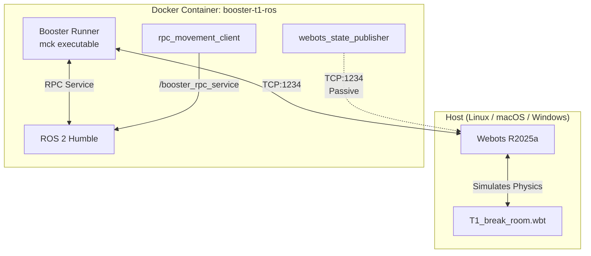

# Booster T1 — Webots + ROS 2 Simulation Environment

[](https://docs.ros.org/en/humble/)
[](https://cyberbotics.com/)
[](https://docs.docker.com/compose/)
[](LICENSE)

Simulation testbed, helper tools, and ROS 2 packages for controlling the **Booster T1** bipedal humanoid robot inside Webots. Runs on **Linux, macOS, and Windows** with Docker.

---

## 🏗️ Architecture Overview

Webots runs **natively on the host** while the ROS 2 controller stack runs inside a **Docker container**. Communication is routed over TCP.



> **Key constraint:** The biped Whole-Body Controller requires `basicTimeStep = 1ms`. Higher timesteps cause instant solver divergence and robot collapse.

For the full architecture deep-dive, see [docs/ARCHITECTURE.md](docs/ARCHITECTURE.md).

---

## 📋 Prerequisites

| Requirement | Linux | macOS | Windows |
|---|---|---|---|
| **Webots** | R2025a ([.deb](https://cyberbotics.com/)) | R2025a ([.dmg](https://cyberbotics.com/)) | R2025a ([.msi](https://cyberbotics.com/)) |
| **Docker** | Docker Engine 24+ | Docker Desktop 4.x | Docker Desktop 4.x + WSL2 |
| **GPU** | NVIDIA + Container Toolkit | CPU only | Optional via WSL2 |
| **Booster Runner** | `booster-runner-webots-full-0.0.11.run` | Same (runs in container) | Same (runs in container) |

> See the detailed setup guides: [Linux](docs/SETUP_LINUX.md) · [macOS](docs/SETUP_MACOS.md) · [Windows](docs/SETUP_WINDOWS.md)

---

## 🚀 Quick Start

### 1. Clone & Fetch Assets

```bash
git clone <repo-url> && cd ISEP-Challenge-Robotics

# Clone Booster robot assets (meshes, URDF)
git clone --depth 1 https://github.com/BoosterRobotics/booster_assets.git webots/assets/booster_assets
```

### 2. Place Booster Runner Binaries

Download from the [Booster T1 Manual](https://www.booster.tech/open-source/) and place in `external/booster_runner/`:
- `booster-runner-webots-full-0.0.11.run`
- `webots_simulation.zip`

```bash
./tools/check_booster_runner_assets.sh   # Verify files are present and valid
```

### 3. Build & Run (Choose Your Platform)

<details>
<summary><b>🐧 Linux</b></summary>

```bash
# Build the container
./containers/build_ros_container.sh

# Run the simulation (walks forward for 10 seconds)
./tools/run_host_simulation.sh forward 10.0
```

</details>

<details>
<summary><b>🍎 macOS</b></summary>

```bash
# Use macOS environment
cp .env.macos .env.local

# Build the container
./containers/build_ros_container.sh

# Start Webots manually, then run the container
./containers/run_ros_container.sh
```

</details>

<details>
<summary><b>🪟 Windows (Git Bash / WSL2)</b></summary>

```bash
# Use Windows environment
cp .env.windows .env.local

# Build the container
./containers/build_ros_container.sh

# Start Webots manually, then run the container
./containers/run_ros_container.sh
```

</details>

Or use **Docker Compose** on any platform:

```bash
docker compose build
docker compose up -d
docker compose exec ros2 bash
```

---

## 🔌 Connection Modes

### Active Mode — Official Walk Planner

Starts the official Booster simulation runner for biped walking and planning.

| Topic | Type | Description |
|---|---|---|
| `/booster_t1/joint_states` | `sensor_msgs/JointState` | Joint positions/states |
| `/booster_t1/imu` | `sensor_msgs/Imu` | IMU orientation, acceleration, velocities |
| `/booster_t1/low_state` | `booster_interface/LowState` | Raw low state data |

**RPC Service:** `/booster_rpc_service` for high-level walk plans.

### Passive Mode — Direct Webots State Bridge

Lightweight connection without the walk planner. Runs `webots_state_publisher` to bridge Webots joint data to ROS 2.

| Topic | Type | Description |
|---|---|---|
| `/joint_states` | `sensor_msgs/JointState` | Joint positions (12 leg joints) |
| `/booster_t1/joint_states` | `sensor_msgs/JointState` | Same, namespaced |

---

## 🏃 Running Simulations

### All-in-One Script (Active Mode)

```bash
./tools/run_host_simulation.sh <command> <duration>
```

**Examples:**

```bash
./tools/run_host_simulation.sh forward 20.0    # Walk forward 20s
./tools/run_host_simulation.sh backward 5.0    # Walk backward 5s
./tools/run_host_simulation.sh turn_left 10.0  # Turn left 10s
```

### Supported Movement Commands

| Command | vx | vy | vyaw | Description |
|---|---|---|---|---|
| `forward` | 0.7 | 0.0 | 0.0 | Walk forward (tuned speed) |
| `backward` | -0.1 | 0.0 | 0.0 | Walk backward |
| `left` | 0.0 | 0.1 | 0.0 | Strafe left |
| `right` | 0.0 | -0.1 | 0.0 | Strafe right |
| `turn_left` | 0.0 | 0.0 | 0.2 | Rotate left |
| `turn_right` | 0.0 | 0.0 | -0.2 | Rotate right |
| `stop` | 0.0 | 0.0 | 0.0 | Stop all movement |

### Manual RPC Client

```bash
ros2 run booster_t1_webots_test rpc_movement_client --command forward --duration 5.0
```

Options:
- `--duration <float>`: seconds to execute (default: `1.0`)
- `--no-prepare`: skip stand-up sequence (use when robot is already walking)
- `--service-name <name>`: RPC service name (default: `/booster_rpc_service`)

---

## 📈 Telemetry

### Launch All Listeners

```bash
# Enter the running container
./containers/enter_ros_container.sh

# Build and launch
cd /workspace/project/ros2_ws
source /opt/ros/humble/setup.bash
colcon build --symlink-install
source install/setup.bash
ros2 launch booster_t1_webots_test booster_t1_break_room.launch.py
```

### Echo Raw Topics

```bash
ros2 topic echo /booster_t1/joint_states
ros2 topic echo /booster_t1/imu
```

---

## 📁 Project Structure

```
ISEP-Challenge-Robotics/
├── containers/              # Docker build & run scripts
│   ├── Containerfile        # ROS 2 Humble container definition
│   ├── entrypoint.sh        # Container entrypoint (ROS 2 + env setup)
│   ├── docker_common.sh     # Shared Docker helpers (platform detection)
│   ├── build_ros_container.sh
│   ├── run_ros_container.sh
│   ├── enter_ros_container.sh
│   └── start_webots_state_bridge.sh
├── docs/                    # Documentation
│   ├── ARCHITECTURE.md      # System architecture deep-dive
│   ├── SETUP_LINUX.md       # Linux setup guide
│   ├── SETUP_MACOS.md       # macOS setup guide
│   ├── SETUP_WINDOWS.md     # Windows setup guide
│   ├── API_REFERENCE.md     # ROS 2 message/service reference
│   ├── DOCKER_REFERENCE.md  # Docker infrastructure reference
│   ├── CONTRIBUTING.md      # Contributor guide
│   └── DEBUGGING.md         # Troubleshooting guide
├── external/                # Vendor dependencies (git-ignored)
│   └── booster_runner/      # Official Booster simulation binaries
├── ros2_ws/src/             # ROS 2 workspace
│   ├── booster_ros2_interface/  # Custom message/service definitions
│   └── booster_t1_webots_test/  # Listener nodes, RPC client, state publisher
├── tools/                   # Host-side automation scripts
│   ├── run_host_simulation.sh
│   ├── start_booster_webots_runner.sh
│   └── check_booster_runner_assets.sh
├── webots/                  # Webots simulation files
│   ├── worlds/              # .wbt world files
│   └── assets/              # Robot meshes & URDF (git-ignored)
├── docker-compose.yml       # Multi-platform Docker Compose
├── .env                     # Default environment variables
├── .env.linux               # Linux-specific overrides
├── .env.macos               # macOS-specific overrides
└── .env.windows             # Windows-specific overrides
```

---

## 📚 Documentation

| Document | Description |
|---|---|
| [Architecture](docs/ARCHITECTURE.md) | System topology, data flows, physics constraints |
| [Linux Setup](docs/SETUP_LINUX.md) | Ubuntu 22.04/24.04 with Docker + NVIDIA GPU |
| [macOS Setup](docs/SETUP_MACOS.md) | Docker Desktop, Apple Silicon support |
| [Windows Setup](docs/SETUP_WINDOWS.md) | WSL2 + Docker Desktop |
| [API Reference](docs/API_REFERENCE.md) | All 20 messages, 2 services, RPC commands |
| [Docker Reference](docs/DOCKER_REFERENCE.md) | Container scripts, env vars, volumes |
| [Contributing](docs/CONTRIBUTING.md) | Dev workflow, code style, PR checklist |
| [Debugging](docs/DEBUGGING.md) | Troubleshooting per platform |

---

## 📄 License

Apache 2.0 — see individual packages for details.
