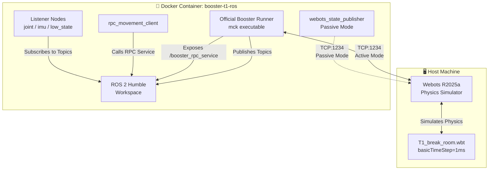
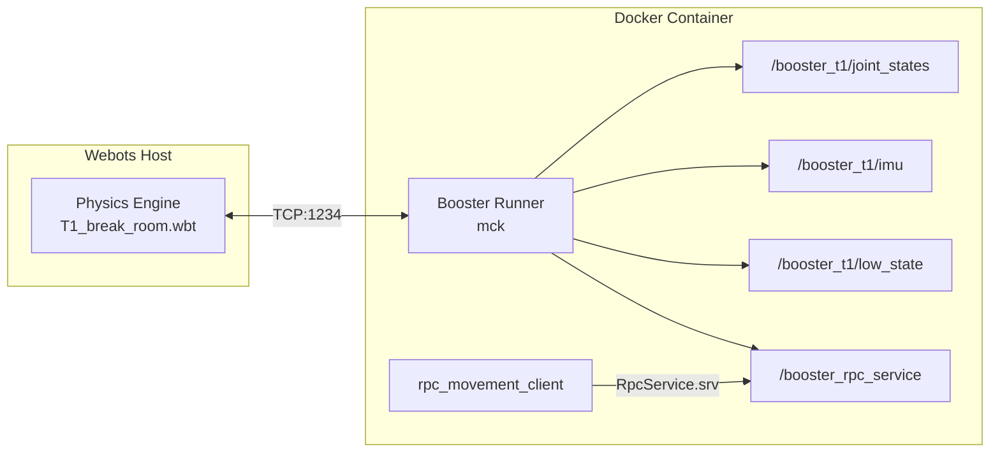
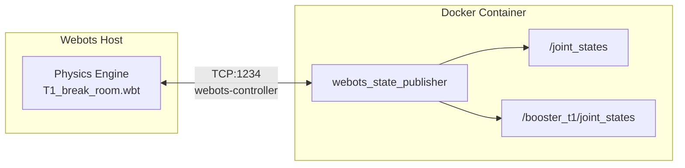
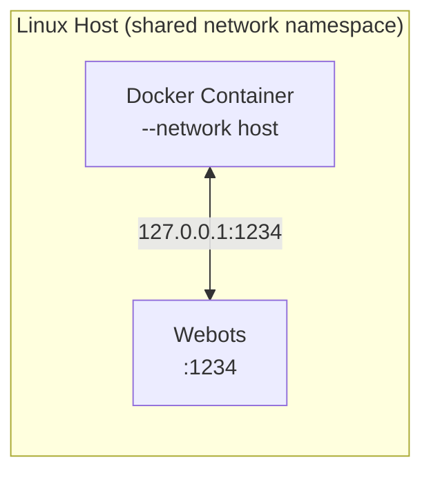
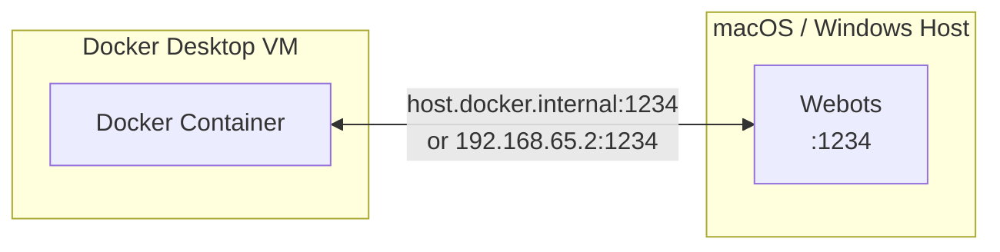
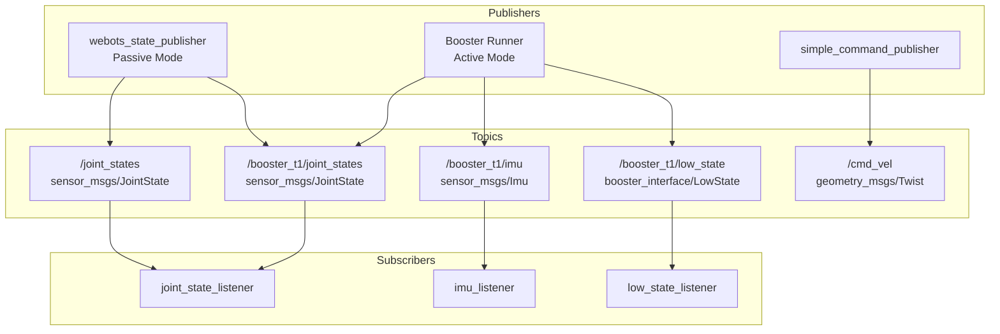
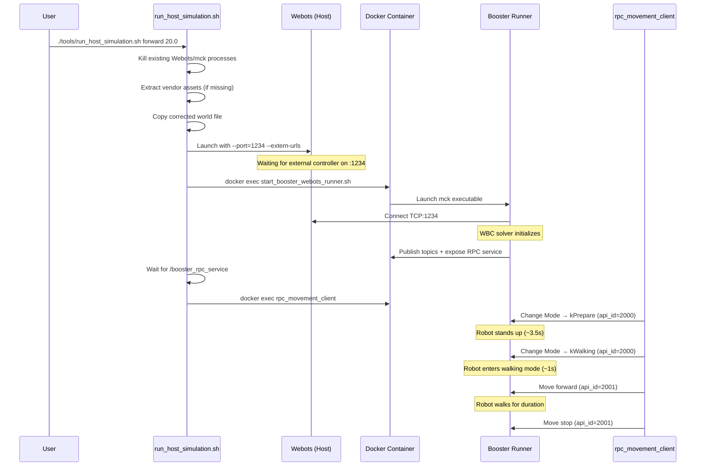
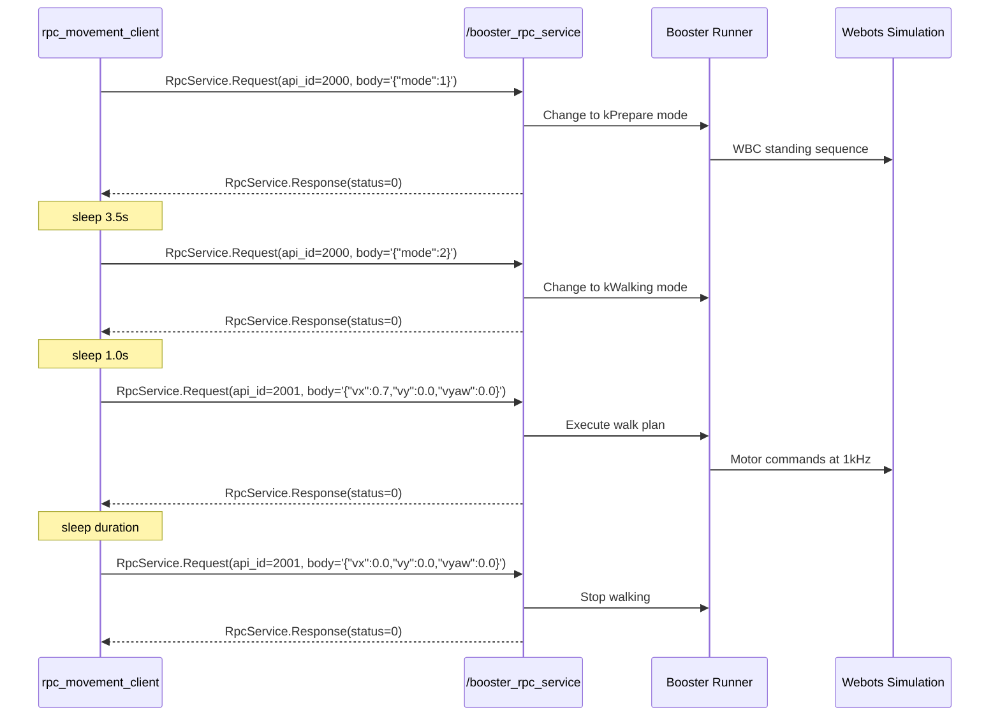
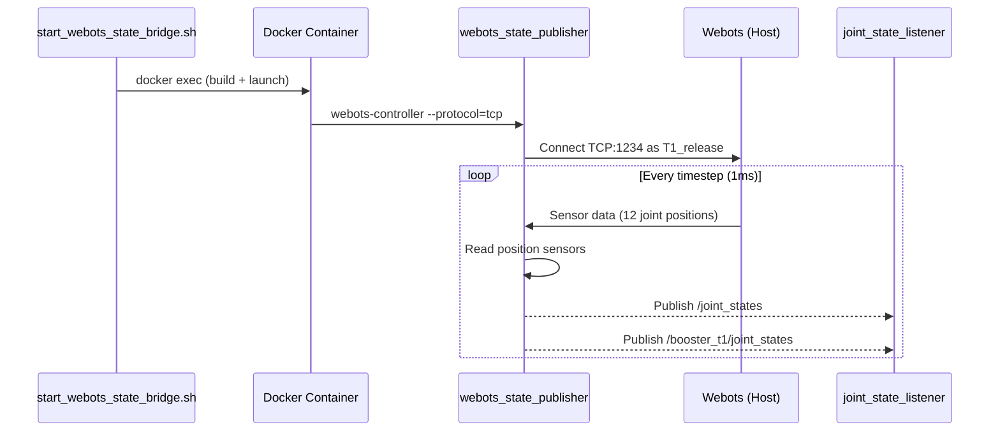

# 🏗️ Architecture

> Deep-dive into the Booster T1 Webots + ROS 2 simulation architecture.

---

## 📐 System Topology

The system is split between a **host-running Webots simulator** and a **Docker-containerized ROS 2 Humble stack**. Communication flows over TCP port 1234 using the Webots external controller protocol.



> [!NOTE]
> Only one connection mode is active at a time. **Active Mode** uses the official Booster runner binary; **Passive Mode** uses a lightweight Python controller.

---

## 🔄 Data Flow Diagrams

### Active Mode (Booster Runner + RPC Service)

In Active Mode, the official Booster simulation runner (`mck` executable) connects to Webots over TCP:1234, runs its Whole-Body Controller (WBC), and exposes ROS 2 topics and services.



### Passive Mode (Webots State Bridge)

In Passive Mode, a custom Python node connects directly to Webots using the `webots-controller` script, reads joint position sensors, and publishes to ROS 2.



---

## ⚙️ Physics Constraints

The biped Whole-Body Controller (WBC) requires high-frequency integration. Incorrect physics parameters cause immediate solver divergence and robot collapse.

| Parameter | Required Value | Consequence of Deviation |
|---|---|---|
| `basicTimeStep` | `1` (1 ms) | Higher values cause WBC solver divergence; the biped collapses instantly |
| `coulombFriction` | `0.4` | Incorrect values cause foot slipping or unrealistic ground contact |
| World file | `T1_break_room.wbt` | Must be the physics-corrected version from `webots/worlds/` |

> [!CAUTION]
> Never increase `basicTimeStep` above 1 ms. The Booster WBC control loop is tuned for 1 kHz integration frequency. Even `basicTimeStep 2` will cause the solver to diverge immediately.

The `run_host_simulation.sh` script always copies the tracked, corrected world file to the runtime location to prevent accidentally running with bad physics parameters:

```bash
cp "${PROJECT_ROOT}/webots/worlds/T1_break_room.wbt" \
   "${PROJECT_ROOT}/.docker/booster_runner/webots_simulation/worlds/T1_break_room.wbt"
```

---

## 🌐 Network Architecture

### Linux (Host Networking)

On Linux with Docker Engine (not Docker Desktop), the container uses `--network host`, sharing the host's network namespace. Webots at `127.0.0.1:1234` is directly reachable from inside the container.



### macOS / Windows (Docker Desktop NAT)

Docker Desktop runs containers inside a Linux VM. Host networking is not available. The container must reach Webots via `host.docker.internal` or the gateway IP `192.168.65.2`.



| Platform | Network Mode | Webots Address from Container | Notes |
|---|---|---|---|
| Linux | `--network host` | `127.0.0.1:1234` | Shared network namespace |
| macOS | Docker Desktop NAT | `host.docker.internal:1234` | VM-based networking |
| Windows (WSL2) | Docker Desktop NAT | `host.docker.internal:1234` | WSL2 VM networking |

---

## 📡 DDS / FastDDS Profile Requirements

Standard ROS 2 discovery uses DDS multicast, which is isolated within the Docker container. To enable cross-process ROS 2 discovery (e.g., `ros2 topic list` from a `docker exec` shell), a FastDDS XML profile must be referenced.

The Booster runner generates a `fastdds_profile.xml` at runtime. Any additional shell that needs to interact with the ROS 2 graph must set:

```bash
export FASTRTPS_DEFAULT_PROFILES_FILE=$(find /tmp -maxdepth 2 -name "fastdds_profile.xml" | head -n 1)
```

> [!IMPORTANT]
> Without the FastDDS profile, `ros2 topic list` from a `docker exec` shell will only see `/parameter_events` and `/rosout`, even when the Booster runner is actively publishing topics.

---

## 📊 ROS 2 Topic Graph

### Published Topics



### Services

| Service | Type | Provider |
|---|---|---|
| `/booster_rpc_service` | `booster_interface/srv/RpcService` | Booster Runner (Active Mode) |

### All Nodes

| Node | Package | Purpose |
|---|---|---|
| `rpc_movement_client` | `booster_t1_webots_test` | Sends walk commands via RPC |
| `webots_state_publisher` | `booster_t1_webots_test` | Passive joint state bridge |
| `topic_listener` | `booster_t1_webots_test` | Enumerates visible ROS 2 topics |
| `joint_state_listener` | `booster_t1_webots_test` | Logs joint state messages |
| `imu_listener` | `booster_t1_webots_test` | Logs IMU messages |
| `low_state_listener` | `booster_t1_webots_test` | Inspects low state topics |
| `simple_command_publisher` | `booster_t1_webots_test` | Publishes zero `/cmd_vel` |

---

## 🔁 Sequence Diagrams

### Startup Sequence (Active Mode via `run_host_simulation.sh`)



### RPC Walk Command Flow



### Passive State Bridge Flow



---

## 📁 File / Directory Structure

```
ISEP-Challenge-Robotics/
├── containers/                     # Docker infrastructure
│   ├── Containerfile               # Docker image definition (ROS 2 Humble)
│   ├── docker_common.sh            # Shared Docker helper functions
│   ├── build_ros_container.sh      # Build the Docker image
│   ├── run_ros_container.sh        # Start interactive container
│   ├── enter_ros_container.sh      # Exec into running container
│   └── start_webots_state_bridge.sh  # Launch Passive Mode
│
├── tools/                          # Host-side automation scripts
│   ├── run_host_simulation.sh      # All-in-one Active Mode launcher
│   ├── start_booster_webots_runner.sh  # Start Booster runner inside container
│   └── check_booster_runner_assets.sh  # Validate vendor binaries
│
├── ros2_ws/                        # ROS 2 workspace
│   └── src/
│       ├── booster_ros2_interface/ # Custom message/service package (ament_cmake)
│       │   ├── msg/               # 20 message definitions
│       │   ├── srv/               # 2 service definitions
│       │   ├── CMakeLists.txt
│       │   └── package.xml
│       └── booster_t1_webots_test/ # Python node package (ament_python)
│           ├── booster_t1_webots_test/
│           │   ├── rpc_movement_client.py    # Walk command client
│           │   ├── rpc_commands.py           # RPC command definitions
│           │   ├── webots_state_publisher.py  # Passive state bridge
│           │   ├── joint_state_listener.py   # Joint state subscriber
│           │   ├── imu_listener.py           # IMU subscriber
│           │   ├── low_state_listener.py     # Low state inspector
│           │   ├── topic_listener.py         # Topic enumerator
│           │   ├── simple_command_publisher.py  # Zero cmd_vel publisher
│           │   ├── listener_base.py          # Subscription helper
│           │   └── message_formatters.py     # Log formatting utilities
│           ├── launch/
│           │   └── booster_t1_break_room.launch.py
│           ├── config/
│           ├── setup.py
│           └── package.xml
│
├── webots/                         # Webots simulation files
│   ├── worlds/
│   │   └── T1_break_room.wbt      # Physics-corrected world file
│   └── assets/                    # Booster robot meshes (gitignored)
│
├── external/                       # Vendor binaries (gitignored)
│   └── booster_runner/            # Official Booster runner files
│       ├── booster-runner-webots-full-*.run
│       ├── webots_simulation.zip
│       └── webots_updated.zip
│
├── .docker/                        # Runtime cache (gitignored)
│   ├── home/                      # Container home directory
│   ├── webots/                    # Extracted controller libraries
│   ├── booster_runner/            # Extracted simulation assets
│   ├── ros2_build/                # colcon build cache
│   └── ros2_install/              # colcon install cache
│
├── .logs/                          # Runtime logs (gitignored)
│   ├── host-webots-break-room.log
│   ├── host-webots-break-room.pid
│   ├── booster-webots-runner.log
│   └── booster-webots-runner.pid
│
├── docs/                           # Documentation
│   ├── ARCHITECTURE.md            # This file
│   ├── SETUP_LINUX.md
│   ├── SETUP_MACOS.md
│   ├── SETUP_WINDOWS.md
│   ├── API_REFERENCE.md
│   ├── CONTRIBUTING.md
│   ├── DOCKER_REFERENCE.md
│   ├── DEBUGGING.md
│   └── FINAL_REPORT.md
│
├── README.md
├── .gitignore
└── .dockerignore
```

---

## 🔗 Related Documentation

- [README](../README.md) — Quick start and overview
- [API Reference](API_REFERENCE.md) — Complete ROS 2 message, service, and topic reference
- [Docker Reference](DOCKER_REFERENCE.md) — Container infrastructure details
- [Setup: Linux](SETUP_LINUX.md) | [macOS](SETUP_MACOS.md) | [Windows](SETUP_WINDOWS.md) — Platform-specific installation guides
- [Debugging](DEBUGGING.md) — Troubleshooting guide
- [Contributing](CONTRIBUTING.md) — Development workflow
